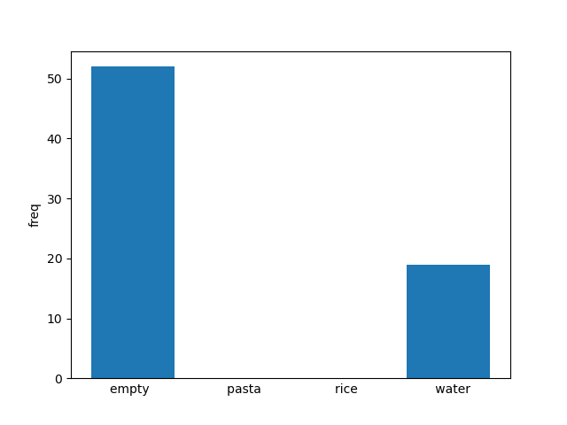
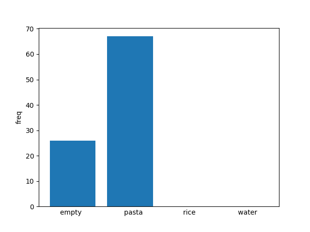
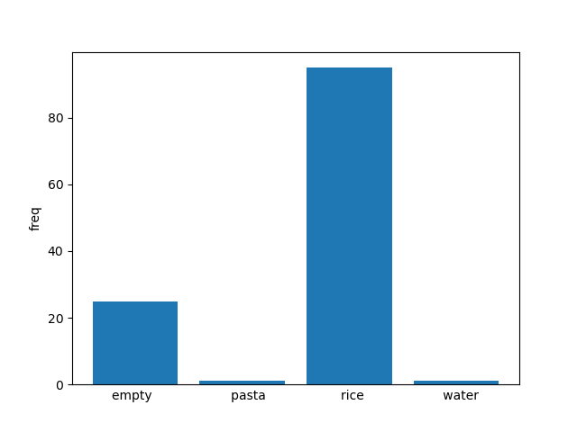

# ICPRchallenge2020
A solution for ICPR 2020 CORSMAL Challenge
URL:http://corsmal.eecs.qmul.ac.uk/ICPR2020challenge.html

## Environment
```
programming language: python
employed hardware:
- OS: CentOS (Microsoft Windows 10 Pro)
- GPU: (4) GeForce RTX 2080 Ti
- GPU RAM: 3６ GB
- CPU: Intel(R) Core(TM) i7-6950X CPU @ 3.00GHz
- RAM: 48 GB
- Cores: 10
Libraries
- conda 4.3.30
- CUDA 10.2
```

## Quick Demo
```
$ git clone git@github.com:YuichiNAGAO/ICPRchallenge2020.git　&&　cd ICPRchallenge2020
```
Download the pre-trained models from [here](https://github.com/YuichiNAGAO/ICPRchallenge2020/releases/) and unzip it under the current directory.
```
$ conda-env create --name [new_env] --file ./env.yml
```
Activate [new_env].
```
$ python test.py --root [path to the dataset]　--folder_num [folder numbers]
```
Then, the `submission.csv` containing the predictions is created under the current directory.

#### Expected file structures

```
root of the scripts
|----- models
|         |----- T1_all_-1_CE_400.pth(model for task 1)
|         |----- T2_all_-1_CE_200.pth(model for task 2)
|----- train_T1.py
|----- train_T2.py
|----- test.py
|----- model.py
|----- Mydataset.py
|----- annotations.csv
|----- utils_t3.py
...

root of the dataset
|----- 13 
|          |----- audio
|          |----- calib
|          |----- depth
|          |----- imu
|          |----- ir
|          |----- rgb
|----- 14
....
```

### About additional annotations
We made additional annotations in `annotations.csv` to improve accuracies. 
`start` / `end` columns indicate when the subject start/finish pouring the filling from a jar into a glass/cup or shaking an already filled food box respectively. The value `-1` denotes that the subject does not pour or shake in that video.

------
## Procedure 

We take deep learning approaches for task1 and task2 and non-deep learning approach for task3. Therefore, we have to preprocess data and train the models for task1 and task2, but we don't have to for task3.


### 1. Data pre-processing for task 2
```
$ python AudioProcessing.py --root [path to the dataset]
```
The preprocessed data is stored under `[path to the dataset]/audio`.

### 2. Training for task 2
```
$ python train_T2.py --root [path to the dataset]
```
other options:
```
  --root ROOT           root directory of the dataset
  --batch_size N        input batch size for training [default: 32]
  --epochs N            number of epochs to train
  --lr LR               learning rate [default: 1e-5]
  --log_interval N      how many batches to wait before logging validation result [default: 10]
  --train_type {all,part}
                        train with all train data or use part of train data as validation [default: all]
  --loss_type {FL,CE}   loss type (Focal loss/Cross entropy) [default: CE]
  --reduction {sum,mean}
                        reduction type of loss [default: mean]
  --val N               which train folder is used as validation (not trained) [default: -1]
```
If you choose `part` for the train type, please make sure to choose a validation folder(i.e., container). Then the chosen folder is removed for training.
If you choose `all`, the the model is trained using all of the train data.
Basically, all of the default options are optimized, so you just need to write path to data directory. For example,
```
$ train_T2.py --root './data'
```

At the end of training, weights of trained model are saved under `[path to the dataset]/T1_results`.

### 3. Data pre-processing for task 1
```
$ python preprocessing_T1.py --root [path to the dataset]
```
The preprocessed data is stored under `[path to the dataset]/T2_mid`.

### 4. Training for task 1
```
$ python train_T1.py --root [path to the dataset]
```
other options:
```
  --root ROOT           root directory of the dataset
  --batch_size N        input batch size for training [default: 16]
  --epochs N            number of epochs to train
  --lr LR               learning rate [default: 1e-4]
  --log_interval N      how many batches to wait before logging validation result [default: 10]
  --train_type {all,part}
                        train with all train data or use part of train data as validation [default: all]
  --loss_type {FL,CE}   loss type (Focal loss/Cross entropy) [default: CE]
  --reduction {sum,mean}
                        reduction type of loss [default: mean]
  --val N               which train folder is used as validation (not trained) [default: -1]
```

At the end of training, weights of trained model are saved under `[path to the dataset]/T1_results`.

### 5. Testing
Please copy the saved models to `./model/` 
```
$ python test.py --root [path to the dataset] --folder_num 10 11 12
```
other options:
```
  --root ROOT
  --folder_num [FOLDER_NUM [FOLDER_NUM ...]]
                        name of folder that you want to test
  --train_type {all,part}
                        please set the same string as you have put in training phase!! train with all train data or
                        use part of train data as validation [default: all]
  --val N               please set the same number as you have put in training phase!! which train folder is used as
                        validation (not trained) [default: -1]
  --loss_type {FL,CE}   please set the same string as you have put in training phase!! loss type (Focal loss/Cross
                        entropy) [default: CE]
  --t1_epochs N         please set the same number as you have put in training phase!! number of epochs to train
                        [default:400]
  --t2_epochs N         please set the same number as you have put in training phase!! number of epochs to train
                        [default:200]
  --step_T3             step of frame in video for object detection using maskrcnn[default:8]
  --view                which view you use for T3                        
```
You have to specify folder number (container number) for which you want to make the prediction.
Also, as for "epochs", "train_type", "val", "loss_type", you need to use the same settings that you have set in train.py.
Basically, all the default options are optimized (the same default as train.py).

At the end of testing, `submission.csv` containing the predictions is created under the current directory.

### 6. Visualize the majority voting of T2
Please confirm that the model for T2 is already trained and saved.

First, you need to save the result of the voting as a json file executing the folloing commnad:
```
python voting.py --root [path to the dataset] --folder_num 10 11 12 
```
Then under the dataset directory, `voting/` folder will be created and the `voting/voting.json` file will appear.
`--folder_num` is an option. You can choose the folder number you want to save.
As for "epochs", "train_type", "val", "loss_type", you need to use the same settings that you have set in `train.py.` 
(These options are the same as the `test.py`. So please refer to `5 Testing`.)

Now you are ready to visualize the data.
Please implement the following commands:
```
python read_voting.py --root [path to the dataset]
```
Then the histgram and visualization of the voting of each data will be saved as `voting/[folder_number]_[file_name]_hist.png` and `voting/[folder_number]_[file_name]_bar.png.`
The holizontal axis of `..._bar.png` is the time, and the length of the graph differs depending on the video length.

other options:
```
--folder-num [FOLDER_NUM [FOLDER_NUM ...]]
                        name of folder that you want to test
--file-name file name
```
If you execute without setting neither folder_num or file_name, all of the data saved in the json file will be visualized.

For example, you can implement like as follows:
```
python read_voting.py --root [path to the dataset] --folder-num 1 --file-name s1_fi3_fu2_b1_l0
```
The result is here:




Other examples are here:







`Black`: emply, `red`:pasta, `green`:rice, `blue`:water
